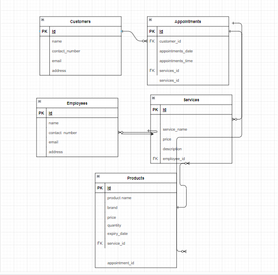

Aplikacija Hair_studio_Ivana je aplikacija za frizerske salone. Ideja ove aplikacije obuhvaća uvid u zaposlenike, naše usluge, proizvode koje koristimo i omogućuje klijentima da sami odaberu proizvod koji njima najviše odgovara. Slijedi prikaz ER modela ove aplikacije.

Korištene su sve potrebne tehnologije: Docker, JQuery, Flask, Kafka i Redis.
Aplikacija nudi mogućnost dodavanja novih zaposlenika, i njihov prikaz u real-time-u kao i brisanje i uređivanje, tako da svi korisnici mogu vidjeti sve trenutne promjene bez osvježavanja stranice.
